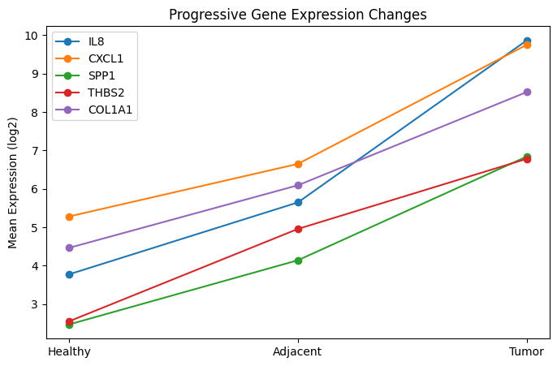

# Colorectal Cancer Gene Expression Analysis

## Overview

This project investigates gene expression changes across healthy colon tissue, adjacent normal tissue, and colorectal tumor tissue using GEO dataset GSE44076.

The goal is to identify genes that show progressive expression changes during colorectal cancer development.

## Dataset

* GEO Accession: GSE44076
* Platform: Affymetrix Human Genome U219 Array
* Samples:

  * Healthy tissue (n = 50)
  * Adjacent normal tissue (n = 98)
  * Tumor tissue (n = 98)

Total samples: 246

## Preliminary Findings

The strongest progressively increasing genes included:

* IL8
* CXCL1
* CXCL2
* SPP1
* THBS2
* TIMP1
* COL1A1
* COL1A2
* COL8A1
* COL12A1

These genes are associated with inflammatory signaling and extracellular matrix remodeling.

Several genes demonstrated increased expression in adjacent normal tissue relative to healthy tissue and further increased expression in tumor tissue.

## Current Status

Completed:

* Data acquisition from GEO
* Expression matrix processing
* Sample grouping
* Differential expression analysis
* Progressive gene identification

Planned:

* Statistical testing
* Visualization
* Literature review
* Research report

## Key Results

| Gene   | Progression Strength |
| ------ | -------------------: |
| IL8    |                 6.09 |
| CXCL1  |                 4.47 |
| SPP1   |                 4.37 |
| THBS2  |                 4.23 |
| PHLDA1 |                 4.15 |
| COL1A1 |                 4.06 |

## Figure 1

